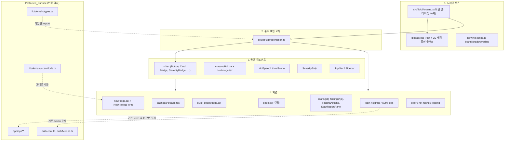
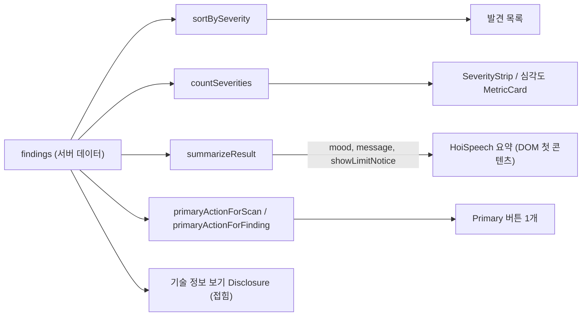

# Design Document

## Overview

이 설계는 `hoi-warm-redesign` 요구사항(요구사항 1~12)을 구현하기 위한 UI 전용 개편 설계다. 목표는 세 가지다.

1. 파랑·미니멀 토큰을 따뜻한 크림·주황·노랑 토큰으로 되돌리고, 모든 텍스트 조합이 WCAG AA를 통과하도록 값을 확정한다.
2. 호이를 레퍼런스(가운데의 노란 호랑이)에 맞게 인라인 SVG로 새로 그리고, 8가지 Mood를 공용 레이어 + Mood별 오버레이 구조로 만든다.
3. 화면별 문구·레이아웃을 "쉬운 요약 → 하나의 다음 행동 → 접힌 기술 정보" 순서로 정리하되, API·enum·인증·스캔 모드 로직은 건드리지 않는다.

판단 로직(라벨 조회, 결과 요약, 정렬, 글자 수 표시, 입력 검증, 탭 이동, 대비 계산, 금지 문구 검사)은 React 컴포넌트에서 떼어 순수 모듈 `src/lib/ui/presentation.ts`와 `src/lib/ui/tokens.ts`로 모은다. 컴포넌트는 이 함수의 결과를 그리기만 한다. 이렇게 하면 핵심 규칙을 속성 기반 테스트로 검증할 수 있다.

### 조사 결과 요약 (현재 코드 기준)

| 영역 | 현재 상태 | 설계 반영 |
|---|---|---|
| `globals.css` `:root` | 파랑 primary(`#2945D7`), 회청색 텍스트 | Warm_Palette로 교체, AA 미달 값 조정 후 주석 기록 |
| `tailwind.config.ts` `brand` | 파랑 7단계(50,100,300,500,600,700,900) | 주황 10단계, `brand-500 = --primary`, `brand-600 = --primary-hover` |
| `.hoi-button-3d`, `.hoi-card-3d` | 평면(filter 밝기만 변경) | 하단 깊이 3px, hover/active 이동, reduced-motion 대응 |
| `ui.tsx` 라벨 맵 | 요구사항과 다른 문구(예: `critical` "매우 급해요") | 요구사항 4의 문구로 교체, 대체 라벨 추가 |
| `Hoi.tsx` | 240 viewBox, `sm` 32px 등 작은 크기, 돋보기 외 오버레이 일부 | 200 viewBox로 재작성, 크기 48/96/160/224px, PNG 옵션 |
| 랜딩 | "마음껏 만들고…" H1, 3단계 | 요구사항 5 문구, 5단계, 가치 카드 3개, 고지 |
| 빠른 점검 | 제한·카운터·Disclosure 있음, 어두운 textarea | 문구 정렬, 밝은 textarea, 오류 분기 함수 추출 |
| 새 프로젝트 1단계 | Primary 버튼 2개(ModeCard 둘 다 primary) | 추천 카드 1개만 Primary, 나머지 secondary |
| NewProjectForm | 탭에 방향키 없음, 일부 hint 없음 | roving tabindex, 모든 입력에 hint + `aria-describedby` |
| 결과 화면 | "호이의 보안 점검 보고서", "전문가 정보" 등 혼재 | 요약 우선 Hoi_Speech, "기술 정보 보기" Disclosure로 통일 |
| 린트 | `next lint`만 있고 ESLint 설정·패키지 없음 | `.eslintrc.json` + ESLint devDependency 추가(런타임 의존성 변화 없음) |
| 테스트 | 테스트 러너 없음 | `vitest` + `fast-check`를 devDependency로 추가 |

### 핵심 설계 결정

| 결정 | 선택 | 근거 |
|---|---|---|
| Primary 버튼 대비 | 주황 `#f58a36` 배경 + 짙은 갈색 `#3a2b20` 텍스트(5.54:1) | 흰 글자는 2.45:1로 불합격. 배경을 `#c2410c`까지 어둡게 하면 흰 글자는 통과하지만 붉은 벽돌색이 되어 따뜻한 주황 인상이 사라진다. 갈색 텍스트는 요구사항 1.9(노랑 위 `--text`)와도 일관된다. |
| `--primary-hover` | `#df7022` → `#e97c2b`(갈색 텍스트 4.77:1) | `#df7022`는 갈색 텍스트 4.19:1로 불합격. `brand-600 = --primary-hover`이고 500보다 어두워야 하므로 AA를 지키는 가장 어두운 근처 값을 고름 |
| 브랜드 텍스트 색 | `brand-800 #9a4410` | cream 6.20:1, primary-soft 5.14:1. `brand-700 #c8611a`는 cream 3.84:1이라 텍스트로 쓰지 않음 |
| 상태 색 | 텍스트 겸용 토큰을 진하게 조정 | `--success #3fae5a`(2.55:1), `--danger #df4d4d`(3.57:1), `--warning #e99b22`(2.10:1), `--info #4a89c7`(3.38:1) 모두 soft 배경에서 불합격 |
| 포커스 링 | `--focus #9e1b32`, 3px, `outline-offset: 2px` | offset 덕분에 링은 버튼 색이 아니라 주변 표면(cream 7.49:1, white 7.90:1) 위에 그려짐 |
| 호이 PNG | 기본은 SVG. `src`가 `/hoi/`로 시작할 때만 이미지, 실패 시 SVG | 외부 요청 금지(3.3), 깨진 이미지 금지(3.5) |
| 순수 로직 분리 | `src/lib/ui/presentation.ts`, `src/lib/ui/tokens.ts` | 속성 기반 테스트 대상, 서버·클라이언트 컴포넌트 양쪽에서 import 가능 |
| 테스트 도구 | `vitest@2.1.9`, `fast-check@3.23.2` (devDependencies, 정확한 버전 고정) | 기존 `tsx`는 러너가 아님. vitest는 esbuild로 `.tsx`와 `@/` 별칭을 처리하고 fast-check는 TS 표준 PBT 라이브러리 |

## Architecture

변경은 네 층으로 나뉜다. 위층은 아래층만 참조하고, Protected_Surface는 읽기만 한다.



### 파일 변경 범위

| 파일 | 변경 | 비고 |
|---|---|---|
| `src/app/globals.css` | 교체 | 토큰, 3D, 배경 장식, 포커스, 모션 |
| `tailwind.config.ts` | 수정 | brand 10단계, 그림자 2단계, 반경, 애니메이션 |
| `src/lib/ui/tokens.ts` | 신규 | 토큰 값과 대비 검사 쌍 |
| `src/lib/ui/presentation.ts` | 신규 | 순수 함수 |
| `src/components/ui.tsx` | 수정 | 변형 스타일, 라벨 맵 re-export, SeverityBadge 아이콘 |
| `src/components/mascot/Hoi.tsx` | 재작성 | SVG 호이 |
| `src/components/mascot/HoiImage.tsx` | 신규 | `"use client"`, PNG + onError 폴백 |
| `src/components/mascot/HoiSpeech.tsx`, `HoiScene.tsx` | 수정 | 반응형 배치, 스타일 |
| `src/components/SeverityStrip.tsx` | 수정 | 라벨 공유, 데이터 없음 상태 |
| `src/components/TopNav.tsx`, `Sidebar.tsx` | 수정 | 문구·모바일 레이아웃 |
| `src/app/page.tsx` | 재작성 | 랜딩 |
| `src/app/dashboard/**` 페이지 | 수정 | 문구·레이아웃·Primary 1개 규칙 |
| `src/components/FindingActions.tsx`, `ScanReportPanel.tsx`, `AuthForm.tsx` | 수정 | 표시 계층만. fetch 경로·메서드·본문 유지 |
| `src/app/error.tsx`, `not-found.tsx`, `loading.tsx`, `dashboard/error.tsx`, `dashboard/loading.tsx` | 수정 | 호이 상태 화면 |
| `public/hoi/SOURCES.md` | 수정 | 에셋 출처 기록 |
| `package.json` | devDependencies·scripts만 | `dependencies` 변경 0건 |
| `.eslintrc.json`, `vitest.config.mts` | 신규 | 린트·테스트 설정 |

Protected_Surface 파일(`src/app/api/**`, `src/lib/domain/types.ts`, `src/lib/domain/scanMode.ts`, `src/lib/auth-core.ts`, `src/lib/authActions.ts`)은 수정하지 않는다.

### 결과 화면 정보 흐름



## Components and Interfaces

### 1. 디자인 토큰 (`globals.css`, `tailwind.config.ts`, `tokens.ts`)

#### 1-1. `:root` 최종 값과 대비 기록

아래 값을 `:root`에 그대로 쓰고, 조정한 항목은 같은 줄 주석에 `기준값 → 조정값 (측정 대비)`를 남긴다(요구사항 1.2). 대비는 WCAG 2.1 상대 휘도 공식으로 계산했다.

| 토큰 | 기준값 | 최종값 | 대표 측정 대비 | 판단 |
|---|---|---|---|---|
| `--background` | `#fff8ed` | `#fff8ed` | – | 유지 |
| `--background-soft` | `#fff1cf` | `#fff1cf` | – | 유지 |
| `--surface` | `#ffffff` | `#ffffff` | – | 유지 |
| `--surface-warm` | `#fffaf2` | `#fffaf2` | – | 유지 |
| `--primary` | `#f58a36` | `#f58a36` | `#3a2b20` 텍스트 5.54 | 유지. 텍스트 색으로 쓰지 않음(cream 위 2.4대) |
| `--primary-hover` | `#df7022` | `#e97c2b` | `#3a2b20` 텍스트 4.19 → 4.77 | 조정 |
| `--primary-soft` | `#ffdfb8` | `#ffdfb8` | `--text` 10.67, `--text-subtle` 4.50 | 유지. 이 배경에는 `--text-muted` 금지(4.22) |
| `--sun` | `#ffc857` | `#ffc857` | `--text` 8.83 | 유지 |
| `--sun-soft` | `#fff0b8` | `#fff0b8` | `--text` 11.90 | 유지 |
| `--crimson` | `#9e1b32` | `#9e1b32` | cream 7.49, `--crimson-soft` 6.65 | 유지 |
| `--crimson-soft` | `#f9e7eb` | `#f9e7eb` | – | 유지 |
| `--success` | `#3fae5a` | `#1f7337` | `--success-soft` 2.55 → 5.31 | 조정 |
| `--success-soft` | `#e8f7eb` | `#e8f7eb` | – | 유지 |
| `--danger` | `#df4d4d` | `#b42f2f` | `--danger-soft` 3.57 → 5.59, 흰 글자 6.20 | 조정 |
| `--danger-soft` | `#fff0ee` | `#fff0ee` | – | 유지 |
| `--warning` | `#e99b22` | `#8a5300` | `--warning-soft` 2.10 → 5.82 | 조정 |
| `--warning-soft` | `#fff5d9` | `#fff5d9` | – | 유지 |
| `--info` | `#4a89c7` | `#2f6aa3` | `--info-soft` 3.38 → 5.18 | 조정 |
| `--info-soft` | `#edf6ff` | `#edf6ff` | – | 유지 |
| `--text` | `#3a2b20` | `#3a2b20` | cream 12.87, white 13.58 | 유지 |
| `--text-subtle` | `#756354` | `#756354` | cream 5.42, soft 5.11, warm 5.51 | 유지 |
| `--text-muted` | `#9a8879` | `#7a6757` | cream 3.22 → 5.10, soft 4.80, warm 5.17 | 조정 |
| `--border` | `#eadbc8` | `#eadbc8` | 장식용 구분선 | 유지(텍스트·입력 경계에 쓰지 않음) |
| `--border-strong` | `#d6bea3` | `#d6bea3` | 카드 테두리 장식 | 유지 |
| `--focus` | `#9e1b32` | `#9e1b32` | cream 7.49, white 7.90, soft 7.05 | 유지 |

추가 토큰(기준 25개 외, 요구사항 위반 아님):

| 토큰 | 값 | 용도·대비 |
|---|---|---|
| `--primary-depth` | `#c8611a` (`brand-700`) | Primary 버튼 하단 깊이(3px) |
| `--primary-text` | `#9a4410` (`brand-800`) | 브랜드색 텍스트. cream 6.20, primary-soft 5.14 |
| `--border-input` | `#967f6b` | 입력·체크박스 경계. white 3.79, cream 3.59 (UI 경계 3:1) |
| `--code` | `#2a1d14` | 코드·diff·로그 패널 배경 |
| `--code-text` | `#fffaf2` | 코드 패널 본문 15.74 |
| `--code-muted` | `#c9b3a0` | 코드 패널 보조 8.13 |
| `--code-focus` | `#ffc857` | 코드 패널 안 포커스 링 10.63 (`--focus`는 2.07이라 사용 불가) |
| `--shadow-sm` | `0 1px 0 rgba(58,43,32,.06), 0 6px 14px rgba(58,43,32,.08)` | 작은 카드 |
| `--shadow-lg` | `0 2px 0 rgba(58,43,32,.06), 0 16px 36px rgba(245,138,54,.16)` | 큰 카드·히어로 |

#### 1-2. Tailwind 확장

```ts
brand: {
  50: "#fff6ec", 100: "#ffead3", 200: "#ffdfb8", 300: "#ffc38a", 400: "#ffa45c",
  500: "#f58a36", // = --primary
  600: "#e97c2b", // = --primary-hover
  700: "#c8611a", 800: "#9a4410", 900: "#6e300c",
},
```

측정한 HSL: 색상각 22°~33°, 명도 96.3 → 91.4 → 86.1 → 77.1 → 68.0 → 58.6 → 54.1 → 44.3 → 33.3 → 23.9 (단조 감소, 요구사항 1.3 충족).

- `boxShadow`: `warm: var(--shadow-sm)`, `warm-lg: var(--shadow-lg)`, `press: 0 3px 0 var(--primary-depth)`
- `borderRadius`: 기본 Tailwind `rounded-2xl`(1rem), `rounded-3xl`(1.5rem) 사용
- 텍스트 규칙: `text-brand-500/600/700` 금지, 브랜드 텍스트는 `text-brand-800`
- `sev` 색은 장식 점·아이콘 채움용: `critical #b42f2f`, `high #c8611a`, `medium #8a5300`, `low #2f6aa3`

#### 1-3. `src/lib/ui/tokens.ts`

```ts
export const WARM_TOKENS = { background: "#fff8ed", /* … 위 표의 최종값 전체 */ } as const;
export type TokenName = keyof typeof WARM_TOKENS;

/** 화면에서 실제로 쓰는 텍스트/배경 조합과 필요한 최소 대비 */
export interface ContrastPair { fg: TokenName; bg: TokenName; min: 4.5 | 3; use: string }
export const CONTRAST_PAIRS: readonly ContrastPair[];

export function relativeLuminance(hex: string): number;
export function contrastRatio(fgHex: string, bgHex: string): number;
```

`CONTRAST_PAIRS`는 `text`/`text-subtle`/`text-muted` × 네 표면, 상태색 × 짝 soft 배경과 cream·white, `text` × `primary`·`primary-hover`·`sun`·`sun-soft`·`primary-soft`, `primary-text` × cream·white·primary-soft, `focus` × 네 표면(3:1), `border-input` × white·cream(3:1), `code-text`·`code-muted`·`code-focus` × `code`, 흰 글자 × `danger`를 포함한다. `globals.css`의 `:root` 값은 `WARM_TOKENS`와 같아야 하며 테스트가 이를 확인한다.

#### 1-4. 전역 CSS 클래스

```css
.hoi-button-3d {
  min-height: 44px; border-radius: 1rem;
  transition: transform 150ms ease, box-shadow 150ms ease, background-color 150ms ease;
}
.hoi-button-3d.is-primary { box-shadow: 0 3px 0 var(--primary-depth); }
.hoi-button-3d:hover:not(:disabled)  { transform: translateY(-2px); }
.hoi-button-3d.is-primary:hover:not(:disabled)  { box-shadow: 0 4px 0 var(--primary-depth); background: var(--primary-hover); }
.hoi-button-3d:active:not(:disabled) { transform: translateY(2px); }
.hoi-button-3d.is-primary:active:not(:disabled) { box-shadow: 0 1px 0 var(--primary-depth); background: var(--primary-hover); }
.hoi-button-3d:disabled { opacity: .5; cursor: not-allowed; transform: none; }

.hoi-card-3d { border: 1px solid var(--border-strong); border-radius: 1.5rem;
  background: var(--surface); box-shadow: 0 3px 0 var(--border-strong), var(--shadow-sm); }

.hoi-page-decor { position: fixed; inset: 0; z-index: -1; pointer-events: none; opacity: .3;
  background:
    radial-gradient(40rem 28rem at 12% -8%, var(--primary-soft), transparent 70%),
    radial-gradient(34rem 24rem at 95% 8%, var(--sun-soft), transparent 70%); }

:focus-visible { outline: 3px solid var(--focus); outline-offset: 2px; }
.bg-code :focus-visible { outline-color: var(--code-focus); }

@keyframes hoi-enter  { from { opacity: 0; transform: translateY(6px) } to { opacity: 1; transform: none } } /* 220ms, 1회 */
@keyframes hoi-search { 0%,100% { transform: translateX(0) rotate(0) } 50% { transform: translateX(3px) rotate(-6deg) } } /* 1.6s 반복 */

@media (prefers-reduced-motion: reduce) {
  .hoi-button-3d, .hoi-button-3d:hover, .hoi-button-3d:active { transform: none !important; }
  .hoi-enter, .hoi-search-prop { animation: none !important; }
}
```

- 배경 장식은 루트 `layout.tsx`의 `<body>` 첫 자식으로 `<div className="hoi-page-decor" aria-hidden="true" />` 하나만 둔다(요구사항 1.6, 1.7). `pointer-events: none`과 `z-index: -1`로 입력을 막지 않는다.
- hover에서 2px 위, active에서 2px 아래, 깊이 3px → 4px(hover) → 1px(active). 전환 150ms(요구사항 2.3, 2.4).
- reduced-motion에서는 이동을 없애고 배경색·그림자 변화만 남는다(요구사항 2.5).
- disabled는 `opacity .5`, `cursor-not-allowed`, 이동 없음. 네이티브 `disabled` 속성이 클릭을 막는다(요구사항 2.6).
- critical 항목에는 어떤 animation 클래스도 붙이지 않는다(요구사항 2.12).

### 2. `ui.tsx` 공용 컴포넌트

모든 기존 export 이름과 prop 시그니처를 유지한다(`Button`, `buttonClassName`, `Card`, `Badge`, `SeverityBadge`, `StatusBadge`, `TestStatusBadge`, `CodeEvidence`, `Evidence`, `Disclosure`, `TechnicalDetails`, `EmptyState`, `FriendlyError`, `SectionHeader`, `MetricCard`, `SimulatedTag`, `AiTag`, `SEV_LABEL`, `STATUS_LABEL`, `TEST_STATUS_LABEL`, `CATEGORY_LABEL`, `categoryLabel`, `TIER_LABEL`, `tierLabel`).

#### 2-1. 버튼 변형

| 변형 | 클래스 | 대비 |
|---|---|---|
| primary | `is-primary border-0 bg-brand-500 text-ink` + `.hoi-button-3d` 규칙 | 5.54 / hover·active 4.77 |
| secondary | `border-2 border-[var(--border-input)] bg-surface text-ink hover:bg-surface-warm` + 하단 `0 3px 0 var(--border-strong)` | 13.58 |
| ghost | `border-transparent bg-transparent text-ink-subtle hover:bg-primary-soft hover:text-ink` | 5.42 / 4.50 |
| danger | `bg-danger text-white` + 하단 `0 3px 0 #7f1f1f` | 6.20 |

크기: `sm` `min-h-11 px-4 text-sm`, `md` `min-h-12 px-5 text-base`, `lg` `min-h-14 px-6 text-lg`. 모두 `rounded-2xl font-bold`.

#### 2-2. 카드 변형

| 변형 | 스타일 |
|---|---|
| default | `rounded-3xl border border-line bg-surface shadow-warm` |
| warm | `rounded-3xl border border-line bg-surface-warm shadow-warm` |
| raised | `.hoi-card-3d` (rounded-3xl, 하단 3px 깊이) |
| flat | `rounded-2xl border border-line bg-surface` (작은 카드) |
| danger | `rounded-3xl border border-[#f3c4bd] bg-danger-soft` |

Card는 기본 `rounded-3xl`, 내부 작은 블록·입력·버튼은 `rounded-2xl`(요구사항 1.5).

#### 2-3. 라벨과 배지

라벨 맵은 `presentation.ts`에서 정의하고 `ui.tsx`가 그대로 re-export한다. 배지는 조회 함수를 거치므로 목록에 없는 값이 들어와도 대체 라벨이 나온다.

```tsx
export function SeverityBadge({ severity, className }: { severity: Severity; className?: string }) {
  const { label, icon } = severityDisplay(severity); // presentation.ts
  return (
    <span data-severity={severity} className={cx(SEV_STYLE[severity] ?? SEV_STYLE_FALLBACK, …)}>
      <SeverityIcon shape={icon} aria-hidden="true" />
      {label}
    </span>
  );
}
```

| 심각도 | 라벨 | 아이콘 모양 (`SeverityIcon`) | 배지 스타일 |
|---|---|---|---|
| critical | 지금 확인해요 | `octagon` 채운 팔각형 + 느낌표 | `bg-danger-soft text-danger border-[#f3c4bd]` |
| high | 먼저 고쳐요 | `triangle` 채운 삼각형 | `bg-primary-soft text-brand-800 border-brand-300` |
| medium | 다듬어 봐요 | `diamond` 마름모 | `bg-warning-soft text-warning border-[#f0d9a6]` |
| low | 여유 있을 때 | `circle` 속 빈 원 | `bg-info-soft text-info border-[#c9def3]` |

`StatusBadge`, `TestStatusBadge`는 톤 맵 + `statusLabel()`/`testStatusLabel()`을 쓴다. `AiTag` 문구는 "AI가 살펴봤어요", `SimulatedTag`는 "격리 시뮬레이션"을 유지한다.

#### 2-4. 기타 컴포넌트

- `Disclosure`: 네이티브 `<details>/<summary>` 유지. 브라우저가 Enter/Space 토글과 펼침 상태 노출을 제공한다(요구사항 8.5, 11.2). 아이콘 `+`는 `aria-hidden`.
- `TechnicalDetails`: 기본 summary를 "기술 정보 보기"로 변경(요구사항 8.5).
- `FriendlyError`: `role="alert"` 유지. `title`, `description`, `action` 슬롯. 스타일만 따뜻하게.
- `MetricCard`: `raised` 카드, 상단 색 띠 `aria-hidden`.
- `CodeEvidence`: 배경 `bg-code`, 본문 `--code-text`, 레이블 `--code-muted`. 콘텐츠는 전달받은 문자열 그대로 출력하며 가공하지 않는다(마스킹 보존, 요구사항 8.10).

### 3. 호이 마스코트

#### 3-1. `Hoi.tsx` API

```ts
export type HoiMood = "welcome" | "guide" | "searching" | "thinking" | "concerned" | "cheer" | "celebrate" | "rest";
export type HoiSize = "sm" | "md" | "lg" | "xl";

export interface HoiProps extends Omit<SVGProps<SVGSVGElement>, "title"> {
  mood?: HoiMood;      // 기본 "welcome"
  size?: HoiSize;      // 기본 "md"
  title?: string;
  decorative?: boolean; // 기본 false
  src?: string;        // 신규·선택. "/hoi/…png"일 때만 사용
}

export const HOI_SIZE_CLASS: Record<HoiSize, string> = {
  sm: "h-12 w-12", md: "h-24 w-24", lg: "h-40 w-40", xl: "h-56 w-56",
};
export const HOI_MOOD_LABEL: Record<HoiMood, string>; // 기존 한국어 라벨 유지
```

- `Hoi`는 서버 컴포넌트에서도 쓸 수 있도록 훅 없이 SVG만 그린다.
- `resolveHoiImageSrc(src)`가 `/hoi/`로 시작하고 `.png`로 끝나며 `//`·`..`·`:`를 포함하지 않는 경우에만 경로를 돌려준다. 그 외에는 `null`이고 SVG를 그린다(요구사항 3.3).
- 경로가 유효하면 `<HoiImage src alt fallback={<HoiSvg …/>} />`를 렌더링한다. `HoiImage`는 `"use client"` 컴포넌트로 `useState(failed)`와 ``를 쓰고, 실패하면 `fallback`을 그린다(요구사항 3.4, 3.5). 크기 클래스와 `alt`(decorative면 `""`, 아니면 Mood 라벨)를 SVG와 같게 맞춘다.
- 접근성: `decorative`면 `aria-hidden="true"`만 두고 `role`·`aria-label`·`<title>`을 생략한다. 아니면 `role="img"`, `aria-label={title ?? HOI_MOOD_LABEL[mood]}`, `<title>` 동일 문구(요구사항 3.17, 3.18).
- 애니메이션: 루트 `<svg>`에 `hoi-enter`(220ms, 1회). `searching`이면 돋보기 그룹에만 `hoi-search-prop`(1.6s 반복, 3px 이동 + 6° 회전). Mood가 바뀌면 돋보기 그룹이 사라지므로 반복도 멈춘다(요구사항 2.9~2.11).

#### 3-2. SVG 구조 (viewBox `0 0 200 200`)

레퍼런스의 호이를 2D 플랫으로 재현한다. 공용 레이어는 모든 Mood에서 같고, Mood별 오버레이만 바뀐다. 각 그룹에 `data-part`를 붙여 테스트가 구조를 확인할 수 있게 한다.

```text
<svg viewBox="0 0 200 200">
  [data-part="tail"]      꼬리: 오른쪽 아래, 짧고 둥근 곡선. 갈색 외곽 stroke 5 + 노랑 채움 + 검은 줄 2개
  [data-part="ears"]      귀 2개: (62,40)·(138,40) 반지름 16, 노랑 채움 + 분홍 안쪽 r7, 외곽 stroke 5
  [data-part="body"]      머리+몸 하나의 path: 둥근 머리(폭 ~120)에서 몸통으로 끊김 없이 이어짐
                          fill #F5B82E, stroke #3B2414, strokeWidth 5, strokeLinejoin round
  [data-part="belly"]     흰 타원 (100,142) rx 30 ry 34, fill #FFFDF6
  [data-part="stripes"]   이마 중앙 굵은 줄 3개(가운데 가장 김), 양 볼 2개씩, 몸 옆 2개씩. #1E1510, 둥근 끝
  [data-part="legs"]      짧은 다리 2개 + 분홍 발바닥 타원(#F28B9B, 테두리 #C8465A)
  [data-part="arms"]      Mood별 팔 자세 (아래 표). 손끝 분홍 발바닥 원
  [data-part="eyes"]      기본: 작은 검은 점(r 4.5). rest: 감은 눈 곡선
  [data-part="brows"]     concerned 전용 진지한 눈썹
  [data-part="nose"]      짙은 갈색 둥근 역삼각형 코
  [data-part="mouth"]     open: 붉은 입 안(#C8323C) + 흰 송곳니 2개(data-part="fangs")
                          closed: 둥근 곡선 입선
  [data-part="prop-*"]    Mood별 소품
</svg>
```

| Mood | 팔 (`arms`) | 눈 | 입 | 소품 |
|---|---|---|---|---|
| welcome | 오른팔을 머리 높이 이상으로 들고 흔듦, 왼팔 내림 | 점 | open + 송곳니 | `prop-wave` 흔들림 표시 선 2개 |
| guide | 오른팔을 몸 옆 수평(±10°)으로 뻗음 | 점 | closed 미소 | 없음 |
| searching | 오른손에 돋보기, 왼팔 내림 | 점 | closed 미소 | `prop-magnifier` (이 Mood에서만) |
| thinking | 한 손을 턱 쪽에 | 점 | closed 일자 | `prop-thought` 점 3개 |
| concerned | 두 팔 몸 앞으로 모음 | 점 | closed 평평한 곡선 | `brows` 진지한 눈썹. 눈물·송곳니 없음 |
| cheer | 한 팔 주먹 들어 올림 | 점 | open + 송곳니 | `prop-star` 별 1개 |
| celebrate | 두 팔 모두 머리 위 | 점 | open + 송곳니 | `prop-confetti` 별·색종이 |
| rest | 두 팔 몸 쪽에 내림 | 감은 눈 곡선 | closed 미소 | 없음 |

구현은 `MOOD_POSE: Record<HoiMood, { arms: ArmPose; eyes: "dot" \| "closed"; mouth: "open" \| "smile" \| "flat"; brows: boolean; props: PropKind[] }>`라는 순수 데이터 테이블로 두고, SVG 조각 함수가 이를 읽어 그린다. 이 테이블은 `presentation.ts`가 아니라 `Hoi.tsx` 안에 export 상수로 둔다(마스코트 전용).

#### 3-3. `HoiSpeech`, `HoiScene`

- `HoiSpeech`: `flex flex-col items-center gap-3 sm:flex-row sm:items-end`. 640px 미만 세로(호이 위, 말풍선 아래), 이상 가로(요구사항 3.19). 말풍선 꼬리는 `sm` 이상에서 왼쪽, 미만에서 위쪽(`aria-hidden`). 기본 `size="md"`, 호이는 `decorative`. 말풍선 자체는 `<div>` 텍스트이므로 스크린리더가 읽는다. 선택 prop `footer?: ReactNode`를 추가해 한계 고지를 같은 영역에 넣을 수 있게 한다(요구사항 8.3).
- `HoiScene`: `rounded-3xl bg-surface-warm` 카드, 호이 `lg`, 제목 레벨 prop 유지.

#### 3-4. `public/hoi/SOURCES.md`

| 에셋 | 제작 방식 | 외부 출처 URL | 이용 조건 | 확인 날짜 |
|---|---|---|---|---|
| `src/components/mascot/Hoi.tsx` 인라인 SVG | 사용자 레퍼런스 이미지를 보고 직접 작성한 SVG | 없음 | 이 저장소 내부 사용. 공식 호이 상표·저작권은 고려대학교에 있음을 명시 | 구현일(YYYY-MM-DD) |
| `public/hoi/*.png` (있을 때만) | 사용자 제공 PNG | 없음(사용자 제공) | 사용자가 제공한 범위 안에서 사용 | 추가일 |

웹 이미지는 내려받거나 핫링크하지 않는다.

### 4. 순수 표현 모듈 `src/lib/ui/presentation.ts`

`import type`으로만 도메인 타입을 참조한다. React·DOM 의존 없음.

```ts
import type { FindingStatus, Severity, TestStatus } from "@/lib/domain/types";
// HoiMood 타입은 여기서 정의하고 Hoi.tsx가 `export type { HoiMood }`로 다시 내보낸다(lib → components 의존 방지, 기존 import 경로 유지)
export type HoiMood = "welcome" | "guide" | "searching" | "thinking" | "concerned" | "cheer" | "celebrate" | "rest";

// 라벨
export const SEV_LABEL: Record<Severity, string>;
export const SEV_EXPERT_LABEL: Record<Severity, string>; // "심각(Critical)" …
export const STATUS_LABEL: Record<FindingStatus, string>;
export const TEST_STATUS_LABEL: Record<TestStatus, string>;
export const UNKNOWN_STATUS_LABEL = "아직 알 수 없는 상태예요";
export function severityLabel(value: unknown): string;
export function statusLabel(value: unknown): string;
export function testStatusLabel(value: unknown): string;
export type SeverityIconShape = "octagon" | "triangle" | "diamond" | "circle" | "dot";
export function severityDisplay(value: unknown): { label: string; icon: SeverityIconShape };

// 정렬·집계
export const SEVERITY_RANK: Record<Severity, number>; // critical 0 … low 3
export function sortBySeverity<T extends { severity: Severity }>(items: readonly T[]): T[]; // 안정 정렬, 새 배열
export function countSeverities(items: readonly { severity: Severity }[]): Record<Severity, number>;

// 결과 요약
export interface ResultSummary { mood: HoiMood; message: string; showLimitNotice: boolean }
export const NO_FINDINGS_MESSAGE = "이번에 확인한 범위에서는 큰 문제가 보이지 않았어요.";
export const LIMIT_NOTICE = "호이가 열심히 살펴보지만 자동 점검만으로 모든 위험을 찾을 수는 없어요. 중요한 서비스는 보안 전문가의 검토도 함께 받아보세요.";
export function summarizeResult(findings: readonly { severity: Severity }[]): ResultSummary;
export function summarizeFinding(status: FindingStatus): { mood: HoiMood; title?: string; message: string };

// 한 화면 하나의 다음 행동
export type FindingPrimaryAction = "generate" | "review" | "verify" | "next";
export function primaryActionForFinding(input: { status: FindingStatus; hasFix: boolean; applied: boolean }): FindingPrimaryAction;
export type ScanPrimaryAction = { kind: "open-finding"; findingId: string } | { kind: "rescan" };
export function primaryActionForScan(findings: readonly { id: string; severity: Severity; status: FindingStatus }[]): ScanPrimaryAction;

// 빠른 점검
export const MAX_SOURCE_CHARS = 100_000;
export function formatCharCount(length: number): string; // "12,345 / 100,000자"
export function isOverSourceLimit(source: string): boolean; // source.length > MAX_SOURCE_CHARS
export function isQuickCheckSubmitDisabled(state: { source: string; running: boolean }): boolean;
export function validateQuickCheckSource(source: string): "empty" | "too_large" | null;
export type QuickCheckErrorKind = "source_too_large" | "internal_error" | "network" | "other";
export function classifyQuickCheckError(input: { networkFailed: boolean; errorCode?: unknown }): QuickCheckErrorKind;
export const QUICK_CHECK_ERROR_COPY: Record<QuickCheckErrorKind, { title: string; description: string }>;

// 새 프로젝트
export const MAX_ZIP_BYTES = 8 * 1024 * 1024; // 8,388,608
export function validateProjectDraft(draft: { name: string; zipSize: number | null }): "name_required" | "zip_too_large" | null;
export function projectEndpoint(hasZip: boolean): "/api/projects/upload" | "/api/projects";

// 탭 roving
export type TabKey = "ArrowLeft" | "ArrowRight" | "Home" | "End";
export function nextTabIndex(current: number, key: TabKey, count: number): number;

// 정직한 안내
export const FORBIDDEN_GUARANTEE_PATTERNS: readonly RegExp[]; // /100\s*%\s*안전/, /완벽(해요|히|하게|한)/, /절대\s*안전/, /문제\s*없음을\s*보장/ …
export function containsGuaranteePhrase(text: string): boolean;
```

#### 4-1. 주요 규칙

| 함수 | 규칙 |
|---|---|
| `summarizeResult` | critical ≥ 1 → `concerned`, "급하게 살펴볼 곳이 있어요. 가장 중요한 1개부터 같이 해결해요." / 그 외 high ≥ 1 → `guide`, "고치면 훨씬 든든해질 부분을 찾았어요." / 그 외 medium·low만 → `cheer`, "큰 위험은 보이지 않았어요. 아래 항목도 다듬으면 더 좋아요." / 0개 → `rest`, `NO_FINDINGS_MESSAGE`, `showLimitNotice: true`. 모든 message는 80자 이하 |
| `summarizeFinding` | `resolved` → `celebrate`, 제목 "잘 막았어요! 한 단계 더 튼튼해졌어요" / `verification_failed`·`regression_failed` → `concerned` / 나머지 → `guide` |
| `primaryActionForFinding` | 위에서부터 첫 일치: `resolved` → `next` / 수정안 없음 → `generate` / 수정안 있고 미적용 → `review`(승인 카드의 반영 버튼은 danger 변형) / `fixed`·`verification_failed`·`regression_failed` → `verify` / 그 외(적용됐지만 재검증 대상 상태가 아님) → `next`. 화면에 실제로 있는 버튼만 가리킨다 |
| `primaryActionForScan` | 미해결(`status !== "resolved"`) 발견 중 심각도 가장 높은 첫 항목 → `open-finding`, 없으면 `rescan` |
| `formatCharCount` | `Math.max(0, Math.floor(n))`를 `toLocaleString("en-US")`로 천 단위 쉼표, 뒤에 `" / 100,000자"` |
| `classifyQuickCheckError` | `networkFailed` → `network` / `"source_too_large"` → 그대로 / `"internal_error"` → 그대로 / 그 외 → `other` |
| `nextTabIndex` | Right `(i+1) % n`, Left `(i-1+n) % n`, Home `0`, End `n-1`. `n ≤ 0`이면 0 |

`validateProjectDraft`는 이름 공백 검사 후 `zipSize > MAX_ZIP_BYTES` 검사 순서다. 스캔 모드별 검증(`validateScanModeInput`)은 기존 `scanMode.ts` 함수를 그대로 호출한다.

### 5. 화면별 설계

#### 5-1. 내비게이션 (`TopNav`, `Sidebar`)

- `Sidebar`(대시보드): 로고 링크 `href="/dashboard"`, 작은 호이(`sm`, decorative) + "호이 보안 코치"(요구사항 9.1). 메뉴 "내 프로젝트"·"빠른 점검"은 링크, "프로젝트 추가"는 Primary 스타일 링크. 활성 항목 `aria-current="page"` + `bg-primary-soft text-brand-800` + 왼쪽 막대(색 외 형태 구분).
- 768px 미만: 상단 바에 로고와 "프로젝트 추가" 버튼, 그 아래 한 줄 `grid grid-cols-2`로 "내 프로젝트"·"빠른 점검". 모든 항목이 추가 탭 없이 보인다(0번 탭, 요구사항 9.3). 각 항목 `min-h-11`, 텍스트 `text-sm`, 가로 스크롤 없음(320px에서 로고 텍스트는 `truncate`, 전체 이름은 `aria-label`).
- 로그아웃은 기존 `logoutAction` 폼 그대로. 모바일에서는 상단 바 오른쪽 작은 secondary 버튼.
- `TopNav`(공개 페이지): 로고 `/`, 링크 앵커(기능 소개/사용 방법), 로그인 여부에 따라 "내 프로젝트"/"로그인". CTA는 랜딩 Primary 1개 규칙을 위해 secondary로 바꾼다.

#### 5-2. 랜딩 (`src/app/page.tsx`)

순서: `TopNav` → 히어로 → 5단계 → 가치 카드 3개 → 고지 → 푸터.

- 히어로(중앙 정렬, `min-h-[calc(100svh-4rem)]` 대신 콘텐츠 높이로 1280×720·375×667 첫 화면 안에 들어가게 `py-10 sm:py-14`): 아이브로우 "바이브 코더를 위한 보안 친구", H1 "내 서비스, 호이와 함께 튼튼하게 만들어요"(페이지 유일 H1), 설명, `HoiSpeech`를 세로 가운데 배치(`mood="welcome"`, `size="lg"`, 말풍선 "어려운 건 제가 쉽게 설명해 드릴게요!"), Primary 링크 "코드만 빠르게 확인하기" → `/dashboard/quick-check`, secondary 링크 "내 프로젝트 점검하기" → `/dashboard/new`. 두 링크 모두 `next/link`라 같은 탭 이동, Enter 동작 기본 제공.
- 모바일 첫 화면을 맞추기 위해 히어로 호이는 `lg`(160px)로 고정하고 설명 문단은 `text-base`.
- 5단계: `<ol>`로 "찾아봐요"→"확인해요"→"고쳐봐요"→"다시 봐요"→"튼튼해졌어요". `lg:grid-cols-5`(1024px 이상 가로), 그 미만 세로 타임라인(왼쪽 세로선 + 번호 원).
- 가치 카드 3개(순서 고정): "쉬운 말로 알려드려요", "근거를 함께 보여드려요", "고친 뒤 한 번 더 확인해요".
- 고지: `LIMIT_NOTICE` 상수를 가치 카드 아래에 그대로 출력.
- 코드 입력 요소 없음. 기존 "결과 예시" 섹션은 제거한다.

#### 5-3. 대시보드 (`dashboard/page.tsx`)

현재 구조(제목, EmptyState, MetricCard 4개, 프로젝트 카드)는 요구사항과 대부분 일치한다. 변경점:

- `HoiSpeech` 요약을 헤더 바로 아래 유지. 금지 표현 검사 통과 문구만 사용.
- 집계 로직을 `computeDashboardMetrics(rows)` 순수 함수로 추출(`presentation.ts`): `resolvedTotal`, `urgentTotal`(미해결 critical+high), `waitingTotal`(최근 스캔 없음), `recentCheckedAt`(최신 ISO 또는 `null`). "최근 점검" 값은 `null`이면 "아직 없어요".
- 데이터 로드 실패(`listProjects` 등 throw)는 `dashboard/error.tsx` 경계가 받아 호이 오류 화면 + "다시 시도하기"(`reset`)를 보여준다. 이때 MetricCard·목록은 렌더링되지 않는다(요구사항 9.9).
- 프로젝트 카드 CTA는 카드 하나에 하나지만 화면 전체 Primary는 헤더 "새 프로젝트 데려오기" 1개로 두고, 카드 CTA는 secondary로 바꾼다.

#### 5-4. 빠른 점검 (`dashboard/quick-check/page.tsx`)

- 제목 "이 코드, 호이가 빠르게 살펴볼게요". `<label htmlFor="source">` 유지.
- textarea는 밝은 표면(`bg-surface border-2 border-[var(--border-input)] font-mono rounded-2xl`)으로 바꾼다. 코드 입력은 코드 패널이 아니므로 요구사항 1.8의 짙은 배경 예외에 넣지 않는다.
- 카운터 `formatCharCount(source.length)`, `id="source-count"`, textarea `aria-describedby`에 연결.
- 초과 안내: `aria-live="polite"` 영역에 `isOverSourceLimit`일 때만 문구. 제출 버튼 `disabled={isQuickCheckSubmitDisabled({ source, running })}`.
- 빈 입력 제출: `validateQuickCheckSource === "empty"`면 fetch 없이 `role="alert"`에 "확인할 코드를 먼저 붙여 넣어 주세요.".
- 진행 중: 입력 카드 아래 `HoiSpeech mood="searching"` + "줄마다 꼼꼼히 읽고 있어요…", `role="status"`. 퍼센트 없음.
- 오류: `classifyQuickCheckError` → `QUICK_CHECK_ERROR_COPY`로 `FriendlyError`. `source` state는 건드리지 않고, `finally`에서 `running=false`.
- 성공: 결과 영역을 입력 카드 아래에 렌더링하고 `requestAnimationFrame`으로 포커스 이동(기존 로직 유지).
- 결과 영역: 제목 아래 `HoiSpeech`(summarizeResult), 0건이면 `footer`에 `LIMIT_NOTICE`. 발견은 `sortBySeverity` 순서. 각 카드의 CWE/OWASP/CVSS/ruleId/원본 근거는 "기술 정보 보기" 안으로 합친다. AI 발견이면 요약 영역에 AI 고지 문단, 시뮬레이션이면 `SimulatedTag`.
- 요청 형태(`POST /api/quick-check`, `{ source }`)는 그대로.

#### 5-5. 새 프로젝트 (`dashboard/new/page.tsx`, `NewProjectForm.tsx`)

- 1단계 페이지 제목 "호이에게 프로젝트를 소개해 주세요". 추천 ModeCard(static)만 Primary, safe_active 카드는 secondary. 격리 옵션은 기존처럼 `Disclosure summary="추가 점검 옵션"` 안(접힘). A/B/C 다이어그램 없음.
- 폼 탭: `role="tablist"` 안 `role="tab"` 버튼 2개, 선택 탭만 `tabIndex=0`, 나머지 `-1`. `onKeyDown`에서 `nextTabIndex`로 이동·포커스·선택. Enter/Space는 버튼 기본 동작. 각 탭 `aria-controls`, 패널 `role="tabpanel" aria-labelledby`. 두 패널을 모두 렌더링하고 비선택 패널은 `hidden` 속성으로 숨겨 값이 유지된다(ZIP 파일 input의 선택도 유지).
- 모든 입력에 `Field hint` 한 문장 + `aria-describedby="{id}-hint"`(이름, ZIP, 붙여넣기, GitHub, 서비스 주소, 테스트 계정 아이디·비밀번호). 오류가 있으면 `aria-describedby`에 오류 id도 추가하고 `aria-invalid`.
- GitHub 입력: label "참고용 GitHub 주소(선택)", Disclosure 밖으로 꺼내 항상 보이게 한다(선택 입력이라 제출을 막지 않음).
- 제출: `validateProjectDraft` → 실패 시 fetch 없이 FriendlyError(제출 버튼 위, `role="alert"`)와 첫 오류 필드 포커스. ZIP 초과는 input 값 비우기. 이어서 기존 `validateScanModeInput` 호출. 요청은 `projectEndpoint(Boolean(zipFile))`로 기존 두 경로를 그대로 사용하고 본문 필드는 변경하지 않는다.
- 제출 버튼 "프로젝트 만들기", 진행 중 "프로젝트를 만들고 있어요…", `disabled`.

#### 5-6. 스캔 결과 (`scans/[id]/page.tsx`, `ScanReportPanel.tsx`)

DOM 순서:
1. `PageHeader` 제목 "호이의 점검 결과"
2. `HoiSpeech`(summarizeResult). 0건이면 `footer`에 한계 고지. `scan.report?.summary`가 있으면 기술 정보 쪽 "자동 보고서 요약" 항목으로 옮긴다(80자 제한 보장).
3. "가장 먼저 할 일" 카드 + Primary 1개: `primaryActionForScan` → `open-finding`이면 `/dashboard/findings/{id}` 링크 "가장 급한 항목 보기", `rescan`이면 프로젝트 상세로 가는 "다시 점검하러 가기".
4. 심각도 요약: MetricCard 4개(라벨은 `SEV_LABEL`) + "문제 재현·확인", "고친 뒤 확인 완료".
5. `ScanReportPanel`: 내부 "첫 문제 해결 시작" 버튼은 secondary로 변경(Primary는 3번 하나).
6. 발견 목록: `sortBySeverity`, 각 항목 링크 카드(SeverityBadge·StatusBadge·AI·시뮬레이션 배지, 제목, 영향, 위치).
7. 점검 범위와 한계(기존 `ScanScopePanel` 유지, 경고 문구 유지).
8. "기술 정보 보기" Disclosure: 실행 계획, 규칙 표, 커버리지 갭, 스캔 상태·ID·시각, 원본 보고서 요약. 기존 필드 모두 유지.

#### 5-7. 발견 상세 (`findings/[id]/page.tsx`, `FindingActions.tsx`)

- 제목 아래 첫 콘텐츠: `HoiSpeech`(summarizeFinding). `resolved`면 `celebrate` + "잘 막았어요! 한 단계 더 튼튼해졌어요".
- 배지 줄: SeverityBadge, StatusBadge, TestStatusBadge, SimulatedTag, AiTag.
- AI 발견이면 요약 영역 안(Disclosure 밖) 고지: "호이가 AI로 코드를 읽고 찾은 내용이에요. 놓치거나 잘못 짚을 수 있어서, 가능한 항목은 실제 확인 단계로 한 번 더 살펴봐요."
- 섹션: 한눈에 보기 → 이대로 두면 어떤 일이 생겨요? → 어디에서 찾았나요? → 이렇게 고쳐보세요(+FindingActions) → 고친 뒤 호이가 확인할 것 → 호이가 확인한 근거 → "기술 정보 보기"(CWE, OWASP, CVSS, ruleId, tier, `SEV_EXPERT_LABEL`, category, id들, 시각, standards, description, 원문 근거).
- `FindingActions`: 현재 구조의 버튼 여러 개 중 `primaryActionForFinding`이 가리키는 버튼 하나만 `variant="primary"`, 나머지는 secondary. 승인 체크박스, 확인 카드 순서, `PRIVILEGED_CHANGE`·apply 확인 단계는 그대로(요구사항 12.6). fetch 경로 `POST /api/findings/{id}/generate-fix|apply-fix|verify`와 본문(없음)은 그대로. 진행 상태 `aria-live` 유지. 성공 메시지는 "잘 막았어요! 한 단계 더 튼튼해졌어요" + 한 항목 범위 한정 문장 유지.
- 원문 근거는 `CodeEvidence`에 저장된 `content`를 그대로 넘긴다. 복사 버튼을 두는 경우 `navigator.clipboard.writeText(evidence.content)`로 화면과 같은 문자열만 복사한다.

#### 5-8. `SeverityStrip`

```ts
export function SeverityStrip(props: { counts?: SeverityCounts | null; resolved?: number | null }): JSX.Element;
```

- `counts`가 없으면 숫자 대신 "발견 수를 불러오지 못했어요" 문구(요구사항 8.12).
- 라벨은 `SEV_LABEL`, 점 대신 `SeverityIcon` 모양 아이콘(aria-hidden), 숫자는 전달값 그대로 정수 표시. 점수·백분율 없음.

#### 5-9. 인증 (`login`, `signup`, `AuthForm`)

- 로그인 h1 "다시 만나서 반가워요!" + `Hoi mood="welcome" size="lg"` 1개. 회원가입 h1 "호이와 첫 점검을 시작해요".
- `AuthForm`의 label/`htmlFor`, `useFormState`, `useFormStatus` 구조 유지. 오류 영역은 폼 상단 `role="alert" aria-live="assertive"`, 서버 action이 돌려준 `state.error` 문장 + 다음 행동 문장("입력한 내용을 확인하고 다시 시도해 주세요."). 자격 증명 불일치 문장은 서버가 준 단일 문장을 그대로 출력(요구사항 10.5).
- 진행 중 버튼 문구 "잠시만요, 확인하고 있어요…" 유지.

#### 5-10. 상태 화면

| 파일 | Mood | h1 | 동작 |
|---|---|---|---|
| `app/error.tsx`, `dashboard/error.tsx` | concerned | "잠시 문제가 생겼어요" | "다시 시도하기"(`reset`), 보조 "이전 화면으로". `error.message`·`digest` 미출력 |
| `app/not-found.tsx` | thinking | "호이가 이 페이지를 찾지 못했어요." | 홈("/") 링크 Primary |
| `app/loading.tsx`, `dashboard/loading.tsx` | searching | (h1 없음) | `role="status"` 안에 호이 + "호이가 화면을 준비하고 있어요…" |

## Data Models

도메인 모델(`SecurityFinding`, `Scan`, `Project`, `Severity`, `FindingStatus`, `TestStatus`, `ExecutionTier`, `SeverityCounts`)은 `src/lib/domain/types.ts`의 기존 정의를 그대로 쓴다. 새로 도입하는 타입은 표시 전용이며 저장·API에 쓰이지 않는다.

### 표시 라벨 (요구사항 4)

| 구분 | 값 → 라벨 |
|---|---|
| `Severity` | critical "지금 확인해요", high "먼저 고쳐요", medium "다듬어 봐요", low "여유 있을 때" |
| `SEV_EXPERT_LABEL` | critical "심각(Critical)", high "높음(High)", medium "보통(Medium)", low "낮음(Low)" |
| `FindingStatus` | detected "확인이 필요해요", verified "실제로 문제가 생기는 걸 확인했어요", fixing "고치는 중이에요", fixed "수정을 적용했어요", verification_failed "아직 완전히 막히지 않았어요", regression_failed "기존 기능을 다시 봐야 해요", resolved "잘 해결했어요" |
| `TestStatus` | CONFIRMED "문제를 확인했어요", SUSPECTED "가능성이 있어요", NOT_DETECTED "이번에는 보이지 않았어요", NOT_APPLICABLE "이 프로젝트에는 해당하지 않아요", NOT_TESTED "아직 확인하지 않았어요", TEST_FAILED "확인 과정이 끝나지 않았어요", FIXED_VERIFIED "고친 뒤 잘 막히는 걸 확인했어요", REGRESSION_FAILED "기존 기능을 다시 봐야 해요" |
| 목록에 없는 값 | `UNKNOWN_STATUS_LABEL` "아직 알 수 없는 상태예요" |

조회 함수는 `Object.prototype.hasOwnProperty.call(MAP, value)`로 확인해 `"toString"` 같은 프로토타입 키에도 대체 라벨을 돌려준다.

### 표시 전용 타입

```ts
interface ResultSummary { mood: HoiMood; message: string; showLimitNotice: boolean }

interface DashboardMetrics {
  resolvedTotal: number;      // 최신 스캔 발견 중 status === "resolved" 수
  urgentTotal: number;        // 최신 스캔 발견 중 미해결 && (critical || high) 수
  waitingTotal: number;       // 최신 스캔이 없는 프로젝트 수
  recentCheckedAt: string | null; // 모든 프로젝트 lastCheckedAt 중 최신
}
interface DashboardRowInput {
  hasLatestScan: boolean;
  findings: readonly { severity: Severity; status: FindingStatus }[];
  lastCheckedAt?: string;
}
export function computeDashboardMetrics(rows: readonly DashboardRowInput[]): DashboardMetrics;

interface HoiPose {
  arms: "wave" | "point" | "hold-magnifier" | "chin" | "together" | "fist" | "both-up" | "down";
  eyes: "dot" | "closed";
  mouth: "open" | "smile" | "flat";
  brows: boolean;
  props: ReadonlyArray<"wave" | "magnifier" | "thought" | "star" | "confetti">;
}
```

### 상수

| 이름 | 값 | 출처 |
|---|---|---|
| `MAX_SOURCE_CHARS` | 100,000 | 기존 quick-check 페이지 값과 동일(서버 `source_too_large` 기준과 일치) |
| `MAX_ZIP_BYTES` | 8,388,608 | 기존 `NewProjectForm` 값과 동일 |
| `HOI_SIZE_CLASS` | sm h-12, md h-24, lg h-40, xl h-56 | 요구사항 3.8 |

## Correctness Properties

*A property is a characteristic or behavior that should hold true across all valid executions of a system-essentially, a formal statement about what the system should do. Properties serve as the bridge between human-readable specifications and machine-verifiable correctness guarantees.*

이 기능은 대부분 UI지만, 판단 로직을 `presentation.ts`·`tokens.ts`·호이 포즈 테이블로 분리했기 때문에 그 부분은 입력에 따라 결과가 달라지는 순수 함수다. 아래 속성은 그 순수 함수와 정적 렌더링 결과(`renderToStaticMarkup`)에 대해서만 정의한다. 화면 배치·첫 화면 노출·키보드 순회 같은 항목은 Testing Strategy의 예시·수동 검사로 다룬다.

속성 정리(중복 제거) 결과:
- 호이 관련 기준(2.10, 3.1, 3.2, 3.8, 3.9~3.16)은 "렌더링 결과가 포즈 테이블과 일치한다"는 모델 기반 속성 하나로 합쳤다. 접근성(3.17, 3.18)과 이미지 경로(3.3)는 성격이 달라 따로 둔다.
- 라벨 기준 4.5와 4.8은 "조회 함수가 전체 입력에 대해 정의된다"는 속성 하나로 합쳤다.
- 결과 요약 기준 8.1, 8.2(Mood), 8.3, 12.5는 `summarizeResult` 속성 하나로 합쳤다.
- 발견 상세의 Mood(8.4)와 Primary 동작(8.7)은 같은 입력(상태·수정안 여부)을 쓰므로 하나로 합쳤다.
- 대비 기준 1.8, 1.10, 2.2, 2.7은 선언된 대비 쌍 목록에 포함되므로 속성 2에 흡수했다.

### Property 1: 대비 계산의 기본 성질

*For any* 두 개의 6자리 hex 색 `a`, `b`에 대해, `contrastRatio(a, b)`는 `contrastRatio(b, a)`와 같고, 1 이상 21 이하이며, `contrastRatio(a, a)`는 1이다.

**Validates: Requirements 1.2**

### Property 2: 선언된 모든 텍스트·배경 조합이 최소 대비를 충족

*For any* `CONTRAST_PAIRS`의 항목 `(fg, bg, min)`에 대해, `contrastRatio(WARM_TOKENS[fg], WARM_TOKENS[bg])`는 `min` 이상이다(일반 텍스트 4.5, 포커스 링·입력 경계 3). 목록에는 본문·보조 텍스트 × 네 표면, 상태색 × soft 배경, `--text` × `--primary`·`--primary-hover`·`--sun`·`--sun-soft`, 흰 글자 × `--danger`, 코드 패널 텍스트 × `--code`, `--focus` × 네 표면이 포함된다.

**Validates: Requirements 1.2, 1.8, 1.9, 1.10, 2.2, 2.7**

### Property 3: 호이 렌더링은 포즈 테이블과 일치

*For any* Mood, 크기, `decorative` 값에 대해, `Hoi`의 정적 마크업은 (a) 루트에 `HOI_SIZE_CLASS[size]`를 갖고, (b) `ears`, `body`, `belly`, `stripes`, `legs`, `arms`, `eyes`, `nose`, `mouth`, `tail` 부분을 모두 포함하며, (c) `arms`·`eyes`·`mouth` 종류와 소품 집합이 `MOOD_POSE[mood]`와 같고, (d) 돋보기 소품과 반복 애니메이션 클래스는 Mood가 `searching`일 때만, 열린 입과 송곳니 2개는 Mood가 `welcome`·`cheer`·`celebrate`일 때만 나타나며, (e) `concerned`에는 송곳니가 없다.

**Validates: Requirements 2.10, 3.1, 3.2, 3.8, 3.9, 3.10, 3.11, 3.12, 3.13, 3.14, 3.15, 3.16**

### Property 4: 호이 접근성 속성

*For any* Mood, 선택적 `title` 문자열, `decorative` 값에 대해, `decorative`가 true이면 마크업 루트는 `aria-hidden="true"`이고 `role`, `aria-label`, `<title>`이 없다. false이면 `role="img"`이고 `aria-label`과 `<title>`이 `title ?? HOI_MOOD_LABEL[mood]`와 같으며 그 값은 한글을 포함한다.

**Validates: Requirements 3.17, 3.18**

### Property 5: 호이 이미지 경로는 내부 PNG로 제한

*For any* 문자열 `src`에 대해, `resolveHoiImageSrc(src)`는 `null`이거나 `/hoi/`로 시작하고 `.png`로 끝나며 `//`, `..`, `:`를 포함하지 않는 문자열이다. 또한 어떤 `src`를 넘겨도 `Hoi` 마크업에 `http://`, `https://`, `//`로 시작하는 URL이 나타나지 않는다.

**Validates: Requirements 3.3, 3.5**

### Property 6: 라벨 조회는 모든 입력에 대해 정의됨

*For any* 값 `v`(enum 값, 임의 문자열, `"toString"` 같은 프로토타입 키, 숫자, `undefined` 포함)에 대해, `severityLabel`, `statusLabel`, `testStatusLabel`은 공백만이 아닌 한글 문자열을 돌려준다. `v`가 해당 enum 값이면 요구사항 표의 라벨과 같고, 아니면 `UNKNOWN_STATUS_LABEL`과 같다.

**Validates: Requirements 4.1, 4.2, 4.3, 4.5, 4.8**

### Property 7: 심각도 배지는 색 없이도 구분됨

*For any* 서로 다른 두 심각도 `s1`, `s2`에 대해, `severityDisplay(s1)`과 `severityDisplay(s2)`는 라벨도 아이콘 모양도 다르다. 그리고 *for any* 심각도 `s`에 대해 `SeverityBadge`의 마크업은 `SEV_LABEL[s]` 텍스트와 `aria-hidden` 아이콘을 포함하고 `animate-`·`hoi-search` 클래스를 포함하지 않는다.

**Validates: Requirements 4.4, 2.12**

### Property 8: 글자 수 표시 형식 왕복

*For any* 0 이상 정수 `n`에 대해, `formatCharCount(n)`은 `/^\d{1,3}(,\d{3})* \/ 100,000자$/` 형식이고, 앞부분에서 쉼표를 지우고 숫자로 읽으면 `n`이 된다.

**Validates: Requirements 6.2**

### Property 9: 글자 수 초과와 제출 비활성화의 동치

*For any* 문자열 `source`와 불리언 `running`에 대해, `isOverSourceLimit(source)`는 `source.length > 100000`과 같고, `isQuickCheckSubmitDisabled({ source, running })`는 `running || source.length > 100000`과 같다. 생성기는 길이 99,999~100,002 경계를 포함한다.

**Validates: Requirements 6.3, 6.7, 6.8**

### Property 10: 빈 코드 제출 차단

*For any* 공백 문자(스페이스, 탭, 개행, 전각 공백 포함)로만 이루어진 문자열에 대해 `validateQuickCheckSource`는 `"empty"`를 돌려준다. *For any* 공백이 아닌 문자를 1개 이상 포함하고 길이가 100,000 이하인 문자열에 대해서는 `null`을 돌려준다.

**Validates: Requirements 6.5**

### Property 11: 빠른 점검 오류 분류

*For any* 오류 코드 값과 `networkFailed` 플래그에 대해, `classifyQuickCheckError`는 `networkFailed`이면 `"network"`, 아니고 코드가 `"source_too_large"`·`"internal_error"`이면 그 값, 그 밖에는 `"other"`를 돌려준다. 결과가 무엇이든 `QUICK_CHECK_ERROR_COPY[kind]`의 제목과 설명은 비어 있지 않고, 설명에는 다음 행동 문장이 들어 있다.

**Validates: Requirements 6.6**

### Property 12: 탭 이동 인덱스

*For any* 탭 개수 `n ≥ 1`과 인덱스 `0 ≤ i < n`에 대해, `nextTabIndex(i, key, n)`은 항상 `[0, n)` 안에 있고, `ArrowRight` 후 `ArrowLeft`를 적용하면 `i`로 돌아오며, `Home`은 0, `End`는 `n - 1`이다.

**Validates: Requirements 7.4**

### Property 13: 프로젝트 입력 검증

*For any* 이름 문자열과 ZIP 크기(`null` 또는 0 이상 정수)에 대해, `validateProjectDraft`는 `name.trim()`이 빈 문자열이면 `"name_required"`, 아니고 크기가 8,388,608을 넘으면 `"zip_too_large"`, 그 밖에는 `null`을 돌려준다. 생성기는 8,388,607~8,388,609 경계를 포함한다.

**Validates: Requirements 7.9, 7.10**

### Property 14: 결과 요약 규칙

*For any* 발견 목록(빈 목록 포함)에 대해, `summarizeResult`의 결과는 (a) `mood === "concerned"`와 "critical이 1개 이상"이 동치이고, (b) 목록이 비었을 때 그리고 그때만 `message === NO_FINDINGS_MESSAGE`이고 `showLimitNotice === true`이며, (c) `message`는 1자 이상 80자 이하이고, (d) `containsGuaranteePhrase(message)`는 false다.

**Validates: Requirements 8.1, 8.2, 8.3, 12.5**

### Property 15: 심각도 정렬은 안정적인 순열

*For any* 발견 목록에 대해, `sortBySeverity`의 결과는 입력과 같은 원소의 순열이고, 인접한 두 원소의 `SEVERITY_RANK`가 감소하지 않으며, 같은 심각도끼리는 입력 순서를 유지하고, 입력 배열을 변경하지 않는다.

**Validates: Requirements 8.2**

### Property 16: 발견 상세의 Mood와 단일 다음 행동

*For any* `FindingStatus`, `hasFix`, `applied` 조합에 대해, `summarizeFinding(status).mood === "celebrate"`와 `status === "resolved"`가 동치이고, `primaryActionForFinding`은 `FindingPrimaryAction` 값 정확히 하나를 돌려주며 그 값은 첫 일치 규칙과 같다(`resolved` → `next`, 수정안 없음 → `generate`, 미적용 수정안 → `review`, `fixed`·`verification_failed`·`regression_failed` → `verify`, 그 외 → `next`).

**Validates: Requirements 8.4, 8.7**

### Property 17: 스캔 결과의 단일 다음 행동

*For any* 발견 목록에 대해, `primaryActionForScan`은 미해결 발견이 있으면 그중 `SEVERITY_RANK`가 가장 낮은(가장 급한) 발견 중 목록에서 처음 나오는 항목의 `open-finding`을, 없으면 `rescan`을 돌려준다.

**Validates: Requirements 8.7**

### Property 18: 근거 표시는 저장된 문자열 그대로

*For any* 문자열 `content`(마스킹 문자 `*`, `•`, HTML 특수문자, 개행 포함)에 대해, `CodeEvidence`의 마크업에서 `<pre>` 안 텍스트를 HTML 디코딩하면 `content`와 정확히 같다.

**Validates: Requirements 8.10**

### Property 19: 심각도 요약 막대는 받은 수만 표시

*For any* 0 이상 정수로 이루어진 `SeverityCounts`와 해결 수에 대해, `SeverityStrip` 마크업은 각 심각도 라벨과 해당 정수를 포함하고, `%`, `점수`, `등급` 문자열을 포함하지 않는다.

**Validates: Requirements 8.11**

### Property 20: 대시보드 지표는 데이터에서만 계산

*For any* 프로젝트 행 목록(빈 목록 포함)에 대해, `computeDashboardMetrics`의 `resolvedTotal`, `urgentTotal`, `waitingTotal`은 행을 직접 세어 얻은 값과 같고, `recentCheckedAt`은 주어진 시각 중 최신 값이며 시각이 하나도 없으면 `null`이다.

**Validates: Requirements 9.6, 9.7, 9.8**

### Property 21: 오류 화면은 오류 원문을 노출하지 않음

*For any* 오류 메시지 문자열과 digest 문자열(고유 토큰으로 생성)에 대해, 루트·대시보드 오류 경계의 정적 마크업에는 두 문자열이 나타나지 않는다.

**Validates: Requirements 10.8**

### Property 22: 절대 보장 표현 차단

*For any* 앞뒤 임의 텍스트와 금지 표현(예: "100% 안전", "완벽해요", "완벽히 보호", "절대 안전") 하나를 이어 붙인 문자열에 대해 `containsGuaranteePhrase`는 true다. 그리고 `presentation.ts`가 내보내는 모든 라벨·요약·오류 문구, `LIMIT_NOTICE`에 대해서는 false다.

**Validates: Requirements 12.4**

## Error Handling

UI 개편이므로 새 오류 경로를 만들지 않고, 기존 오류 처리의 표시 방식만 바꾼다. 서버 응답 코드와 오류 문자열은 그대로 두고 표시 문구만 매핑한다.

| 상황 | 처리 | 사용자 표시 |
|---|---|---|
| 빠른 점검 빈 입력 | fetch 전 `validateQuickCheckSource` | `role="alert"` "확인할 코드를 먼저 붙여 넣어 주세요." |
| 빠른 점검 100,000자 초과 | 버튼 비활성, 서버도 `source_too_large` | `aria-live` 초과 안내 / FriendlyError "코드가 조금 길어요" + 나눠 넣기 안내 |
| 빠른 점검 `internal_error` | FriendlyError | "지금은 코드를 살펴보기 어려워요. 잠시 후 다시 시도해 주세요." |
| 빠른 점검 네트워크 실패 | `catch` → `network` | "연결이 잠깐 끊겼어요. 인터넷 연결을 확인하고 다시 시도해 주세요." |
| 빠른 점검 기타(권한 등) | `other` | "검사를 마치지 못했어요. 로그인 상태와 코드를 확인한 뒤 다시 시도해 주세요." |
| 프로젝트 이름 누락 / ZIP 8MB 초과 | fetch 전 `validateProjectDraft` | 제출 버튼 위 FriendlyError, 해당 입력 `aria-invalid` + 포커스, ZIP은 선택 해제 |
| 스캔 모드 검증 실패 | 기존 `validateScanModeInput` + `SCAN_MODE_ERROR_MESSAGE` | 기존 문구를 FriendlyError로 |
| 프로젝트 생성 실패 | 기존 `friendlyProjectError` 유지 | FriendlyError, 입력 유지, 버튼 재활성 |
| 수정안 생성·적용·재검증 실패 | 기존 `mapError` 유지 | FriendlyError(제목·메시지·"현재 상태는 유지됐어요" 문장) — 기존 정보 빠짐없이 |
| 인증 실패 | 서버 action의 `state.error` | 폼 상단 alert, 서버 문장 그대로 + 다음 행동 문장 |
| 렌더링 오류 | `error.tsx` 경계 | concerned 호이, "잠시 문제가 생겼어요", "다시 시도하기"(`reset`). `error.message`·`digest` 미표시 |
| 없는 경로·권한 없는 리소스 | 기존 `notFound()` | thinking 호이, "호이가 이 페이지를 찾지 못했어요.", 홈 링크 |
| 심각도 수 없음 | `SeverityStrip` `counts` 없음 | "발견 수를 불러오지 못했어요" (0 표시 안 함) |
| 알 수 없는 enum 값 | 라벨 조회 대체 | "아직 알 수 없는 상태예요" |
| 호이 PNG 로드 실패 | `HoiImage` `onError` | 같은 크기·접근성의 SVG로 교체, 깨진 이미지 없음 |
| 잘못된 호이 `src`(외부 URL 등) | `resolveHoiImageSrc` → `null` | SVG 표시, 요청 없음 |

모든 실패 메시지는 "무엇이 안 됐는지 + 다음에 할 일" 두 요소를 갖고, 사용자를 탓하는 표현이나 절대 보장 표현을 쓰지 않는다.

## Testing Strategy

### 도구

| 도구 | 버전 | 위치 | 용도 |
|---|---|---|---|
| `vitest` | `2.1.9` (고정) | devDependencies | 단위·속성 테스트 러너 |
| `fast-check` | `3.23.2` (고정) | devDependencies | 속성 기반 테스트 생성기 |
| `eslint` | `8.57.0` (고정) | devDependencies | `next lint` 실행용 |
| `eslint-config-next` | `14.2.35` (고정, `next`와 동일) | devDependencies | `.eslintrc.json`의 `next/core-web-vitals` |

`dependencies`(`next`, `react`, `react-dom`)는 바꾸지 않는다(요구사항 12.7). 현재 저장소에는 ESLint 설정과 패키지가 없어 `npm run lint`가 대화형 설정을 요구하므로, 요구사항 12.8을 만족하려면 위 두 devDependency와 `.eslintrc.json`(`{ "extends": "next/core-web-vitals" }`)이 필요하다.

`package.json` scripts 추가: `"test": "vitest --run"`.

`vitest.config.mts`:

```ts
import { defineConfig } from "vitest/config";
import { fileURLToPath } from "node:url";

export default defineConfig({
  esbuild: { jsx: "automatic" }, // tsconfig의 jsx: preserve와 별개로 테스트에서만 변환
  resolve: { alias: { "@": fileURLToPath(new URL("./src", import.meta.url)) } },
  test: { environment: "node", include: ["src/**/*.test.{ts,tsx}"] },
});
```

컴포넌트 속성 테스트는 DOM 없이 `react-dom/server`의 `renderToStaticMarkup`으로 마크업 문자열을 검사한다(이미 있는 런타임 의존성 사용). 서버 전용 모듈(`@/lib/auth`, store)을 import하는 페이지는 속성 테스트 대상에서 뺀다.

### 속성 기반 테스트

- Correctness Properties의 각 속성을 **하나의** fast-check 속성 테스트로 구현한다.
- 모든 속성 테스트는 `fc.assert(fc.property(...), { numRuns: 100 })` 이상으로 실행한다. 입력 공간이 작은 속성(Mood 8개, 심각도 4개)도 `numRuns: 100`을 유지하고 `fc.constantFrom`과 다른 입력(`title`, 크기, 플래그)을 조합한다.
- 각 테스트 위에 설계 속성을 가리키는 주석 태그를 단다.
  - 형식: `// Feature: hoi-warm-redesign, Property {번호}: {속성 문장}`
  - 예: `// Feature: hoi-warm-redesign, Property 9: 글자 수 초과와 제출 비활성화의 동치`
- 파일 배치:
  - `src/lib/ui/__tests__/tokens.property.test.ts` — 속성 1, 2
  - `src/lib/ui/__tests__/presentation.property.test.ts` — 속성 6, 8~17, 20, 22
  - `src/components/__tests__/hoi.property.test.tsx` — 속성 3, 4, 5
  - `src/components/__tests__/ui.property.test.tsx` — 속성 7, 18, 19
  - `src/app/__tests__/error-boundary.property.test.tsx` — 속성 21
- 생성기 요점:
  - hex 색: `fc.integer({ min: 0, max: 0xffffff })` → `#rrggbb`
  - 발견: `fc.record({ id: fc.uuid(), severity: fc.constantFrom(...4개), status: fc.constantFrom(...7개) })` 배열, 빈 배열 포함
  - 코드 길이 경계: `fc.oneof(fc.integer({ min: 99_999, max: 100_002 }), fc.integer({ min: 0, max: 200_000 }))`로 길이를 뽑고 `"a".repeat(n)` 생성
  - 공백 문자열: `fc.array(fc.constantFrom(" ", "\t", "\n", "\r", "\u3000")).map((a) => a.join(""))`
  - ZIP 크기 경계: `fc.oneof(fc.constant(null), fc.integer({ min: 8_388_607, max: 8_388_609 }), fc.nat())`
  - 오류 원문: `fc.uuid().map((u) => "ERRTOKEN-" + u)`로 우연한 일치를 피함

### 예시 기반 단위 테스트 (적게, 속성으로 못 다루는 부분만)

- 토큰 동기화: `globals.css` `:root` 값 = `WARM_TOKENS`, brand 500/600 = primary/primary-hover, brand 명도 단조 감소, 그림자 rgba가 갈색·주황 계열.
- 라벨 표 전체 일치(요구사항 4.1~4.3의 정확한 문구), `SEV_EXPERT_LABEL`.
- CSS 규칙: `.hoi-button-3d` hover/active 이동 값·전환 시간, reduced-motion 블록, `.hoi-page-decor` opacity ≤ 0.35·`pointer-events: none`, `:focus-visible` 3px.
- `Button` disabled 마크업, 변형별 클래스, `Card` 반경 클래스.
- `HoiSpeech` 반응형 클래스(`flex-col sm:flex-row`), `footer` 렌더링.
- `HoiImage`: 유효 `src`로 ``와 `alt`, `decorative`면 `alt=""`.
- 랜딩 정적 마크업: H1 1개와 문구, 아이브로우, 두 CTA의 `href`, textarea 없음, 5단계 순서, 가치 카드 3개 순서, `LIMIT_NOTICE` 원문.
- `SeverityStrip` `counts` 없음 → 안내 문구, 숫자 0 없음.
- `not-found`·`loading` 마크업: Mood, 문구, `role="status"`.
- `projectEndpoint(true/false)`.

### 수동·스모크 검사 (자동화 비용이 큰 항목)

- `npm run build`, `npm run lint`, `npm run verify:rules`, `npm run verify:definitions`, `npm test` 모두 통과(요구사항 12.8).
- `git diff --stat -- src/app/api src/lib/domain src/lib/auth-core.ts src/lib/authActions.ts` 결과가 비어 있음(요구사항 12.1).
- `package.json`의 `dependencies`가 변경 전과 같음(요구사항 12.7).
- 저장소 문구 스캔: `src/app`, `src/components`의 `.tsx` 문자열 리터럴에 대해 `containsGuaranteePhrase` 실행(요구사항 12.4 보강). 예시 테스트 하나로 구현.
- 브라우저 확인: 320·375·768·1024·1280·1440px에서 가로 스크롤 없음, 1280×720·375×667에서 랜딩 히어로 요소가 첫 화면 안에 있음, 키보드만으로 빠른 점검·프로젝트 생성·수정 흐름 완료, 탭 방향키 동작, 스크린리더로 진행 상태 알림 확인, OS reduced-motion 켠 상태에서 버튼·호이 정지.
- 호이 시각 확인: 8가지 Mood를 한 화면에 모은 임시 페이지 없이, 각 사용처(랜딩·빠른 점검·결과·오류)에서 레퍼런스와 비교.

WCAG 준수는 위 자동 대비 검사와 수동 점검으로 확인하지만, 완전한 검증에는 보조기기를 사용한 수동 테스트와 접근성 전문가 검토가 필요하다.
